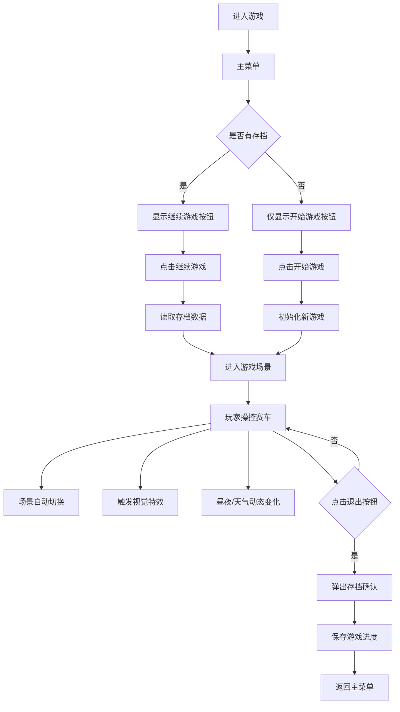

## 1. 产品概述

一款第三人称单人网页像素风格赛车游戏，风格致敬《QQ飞车》，主打轻快华丽的视觉体验。玩家操控赛车在霓虹都市、海滨公路等多彩场景中飞驰，享受漂移、氮气加速等丰富的驾驶乐趣。游戏支持动态天气与昼夜变化，可手动存档并持续运行。

- **目标用户**：喜欢休闲赛车游戏、像素风格视觉的网页游戏玩家
- **核心价值**：提供低门槛、高视觉享受的赛车驾驶体验

## 2. 核心功能

### 2.1 用户角色

| 角色 | 注册方式 | 核心权限 |
|------|----------|----------|
| 玩家 | 无需注册，直接进入 | 操控赛车、切换视角、存档/读档、退出游戏 |

### 2.2 功能模块

1. **游戏主界面**：开始游戏按钮、继续游戏按钮、操作说明、HUD显示
2. **赛车控制系统**：加速、刹车、左右转向、漂移、氮气加速
3. **赛道场景系统**：霓虹都市、海滨公路、山间赛道等多个场景，自动切换
4. **视觉特效系统**：漂移彩色烟雾、氮气蓝色火焰、速度拖尾光效
5. **动态环境系统**：昼夜变化、晴雨天气动态切换
6. **存档系统**：手动保存游戏进度、读取存档

### 2.3 页面详情

| 页面名称 | 模块名称 | 功能描述 |
|----------|----------|----------|
| 主菜单 | 开始界面 | 开始游戏、继续游戏、操作说明、游戏标题动画 |
| 游戏画面 | HUD界面 | 速度表、氮气条、当前场景、时间/天气显示、退出按钮 |
| 游戏画面 | 赛车视角 | 第三人称跟随视角，可切换视角距离 |
| 游戏画面 | 赛道场景 | 多场景赛道，每隔一段时间自动切换过渡 |
| 游戏画面 | 粒子特效 | 漂移烟雾、氮气火焰、速度光效、地面轮胎印 |
| 存档界面 | 存档管理 | 显示存档信息、保存、读取、删除存档 |

## 3. 核心流程

## 4. 用户界面设计

### 4.1 设计风格

- **主色调**：霓虹粉(#FF2D95)、电光蓝(#00D4FF)、赛博紫(#8B5CF6)、活力黄(#FFE600)
- **辅助色**：深黑(#0A0A1A)、午夜蓝(#1A1A3E)
- **整体风格**：轻快华丽像素风，赛博朋克+复古像素融合
- **按钮风格**：像素化圆角矩形，带霓虹发光边框，悬停时有脉冲动画
- **字体**：像素风格字体 (Press Start 2P) 搭配现代无衬线字体
- **图标**：8-bit 像素风格图标
- **布局**：游戏画面居中，HUD元素分布在四角，不遮挡驾驶视野

### 4.2 页面设计概览

| 页面名称 | 模块名称 | UI元素 |
|----------|----------|--------|
| 主菜单 | 开始界面 | 像素风游戏标题(带霓虹发光)、像素按钮、背景动态粒子、操作说明面板 |
| 游戏画面 | 速度表 | 左下角像素风格速度仪表盘，数字跳动动画 |
| 游戏画面 | 氮气条 | 右下角蓝色能量条，使用时有流光效果 |
| 游戏画面 | 场景信息 | 顶部中央显示当前场景名称，切换时有淡入淡出动画 |
| 游戏画面 | 时间天气 | 右上角显示时间和天气图标 |
| 游戏画面 | 退出按钮 | 左上角像素风退出按钮 |
| 存档界面 | 存档面板 | 半透明黑色遮罩、存档卡片、像素按钮、保存/读取/删除操作 |

### 4.3 响应式

- **桌面优先设计**，支持 1280x720 及以上分辨率
- 画布自适应屏幕尺寸，保持 16:9 宽高比
- 移动端支持触屏虚拟按键控制

### 4.4 Canvas 场景设计

- **环境氛围**：多层视差滚动背景，霓虹灯光晕，地面反光效果
- **光照设置**：动态全局光照，昼夜颜色渐变，车灯实时照射
- **视角设置**：第三人称跟随摄像机，过弯时平滑偏移，氮气加速时推近效果
- **构图与焦点**：赛车位于画面中下方 1/3 处，赛道弯道引导视线
- **后处理效果**：Bloom发光、速度线、雨滴粒子、屏幕雨滴效果
- **性能控制**：粒子系统对象池，LOD策略，目标60FPS
