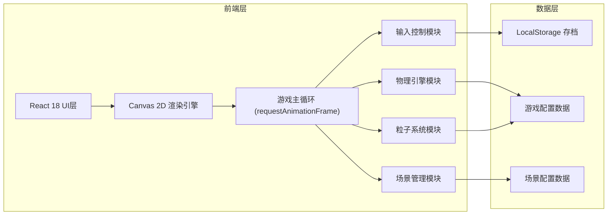

## 1. 架构设计



## 2. 技术说明

- **前端框架**: React@18 + TypeScript + Vite@5
- **样式方案**: TailwindCSS@3
- **渲染技术**: HTML5 Canvas 2D API
- **游戏循环**: requestAnimationFrame 实现固定时间步长更新
- **数据存储**: localStorage (存档系统)
- **无后端服务**，纯前端单机游戏

## 3. 路由定义

| 路由 | 用途 |
|------|------|
| / | 主菜单界面 (开始/继续/操作说明) |
| /game | 游戏主场景 |

## 4. 核心模块设计

### 4.1 游戏引擎核心类

```typescript
// 游戏主类
class GameEngine {
  canvas: HTMLCanvasElement
  ctx: CanvasRenderingContext2D
  car: Car
  track: Track
  particles: ParticleSystem
  environment: Environment
  camera: Camera
  input: InputManager
  running: boolean

  start(): void
  stop(): void
  update(dt: number): void
  render(): void
}

// 赛车类
class Car {
  x: number
  y: number
  angle: number
  speed: number
  maxSpeed: number
  acceleration: number
  nitro: number
  maxNitro: number
  drifting: boolean
  driftAngle: number

  update(dt: number, input: InputState): void
  draw(ctx: CanvasRenderingContext2D): void
}

// 粒子系统
class ParticleSystem {
  particles: Particle[]
  pool: Particle[]

  emitSmoke(x: number, y: number, color: string): void
  emitNitroFlame(x: number, y: number, angle: number): void
  emitSpeedTrail(x: number, y: number): void
  update(dt: number): void
  draw(ctx: CanvasRenderingContext2D): void
}

// 环境系统 (昼夜+天气)
class Environment {
  timeOfDay: number     // 0-24
  weather: WeatherType  // sunny, cloudy, rain, night
  transitionProgress: number

  update(dt: number): void
  getSkyGradient(): string[]
  getAmbientLight(): number
  drawWeatherEffects(ctx: CanvasRenderingContext2D): void
}

// 场景管理
class SceneManager {
  currentScene: SceneType
  sceneTimer: number
  transitionState: TransitionState
  scenes: SceneConfig[]

  update(dt: number): void
  getCurrentSceneConfig(): SceneConfig
  drawSceneBackground(ctx: CanvasRenderingContext2D): void
}
```

### 4.2 存档数据结构

```typescript
interface GameSave {
  id: string
  timestamp: number
  playTime: number           // 总游戏时长(秒)
  currentScene: SceneType
  currentSpeed: number
  nitro: number
  timeOfDay: number
  weather: WeatherType
  totalDistance: number      // 总行驶距离
  highScore: number
}
```

### 4.3 场景配置

```typescript
type SceneType = 'neon_city' | 'coastal_highway' | 'mountain_road' | 'desert_sunset'

interface SceneConfig {
  id: SceneType
  name: string
  duration: number           // 场景持续时间(秒)
  roadColor: string
  roadsideColor: string
  skyColors: [string, string]
  buildingColors: string[]
  neonColors: string[]
  obstacles: ObstacleConfig[]
}
```

## 5. 目录结构

```
src/
├── components/
│   ├── MainMenu.tsx        # 主菜单组件
│   ├── GameCanvas.tsx      # 游戏画布组件
│   ├── HUD.tsx             # HUD界面组件
│   ├── SaveModal.tsx       # 存档弹窗
│   └── Controls.tsx        # 操作说明
├── game/
│   ├── engine/
│   │   ├── GameEngine.ts   # 游戏引擎核心
│   │   ├── Car.ts          # 赛车逻辑
│   │   ├── Track.ts        # 赛道生成
│   │   └── Camera.ts       # 摄像机跟随
│   ├── effects/
│   │   ├── ParticleSystem.ts  # 粒子系统
│   │   └── PostProcessing.ts  # 后处理效果
│   ├── environment/
│   │   ├── Environment.ts     # 昼夜天气系统
│   │   └── SceneManager.ts    # 场景管理
│   └── input/
│       └── InputManager.ts    # 输入控制
├── data/
│   ├── scenes.ts           # 场景配置数据
│   └── config.ts           # 游戏常量配置
├── utils/
│   ├── storage.ts          # localStorage 封装
│   └── math.ts             # 数学工具函数
├── types/
│   └── index.ts            # TypeScript类型定义
├── App.tsx
├── main.tsx
└── index.css
```

## 6. 性能优化策略

1. **粒子对象池**: 预分配粒子对象，避免频繁GC
2. **离屏渲染**: 静态背景元素缓存到离屏Canvas
3. **帧率控制**: requestAnimationFrame + 固定时间步长
4. **视差裁剪**: 只渲染摄像机可见区域
5. **像素渲染**: 使用 imageSmoothingEnabled = false 保持像素风格
6. **节流更新**: 非关键逻辑降低更新频率
